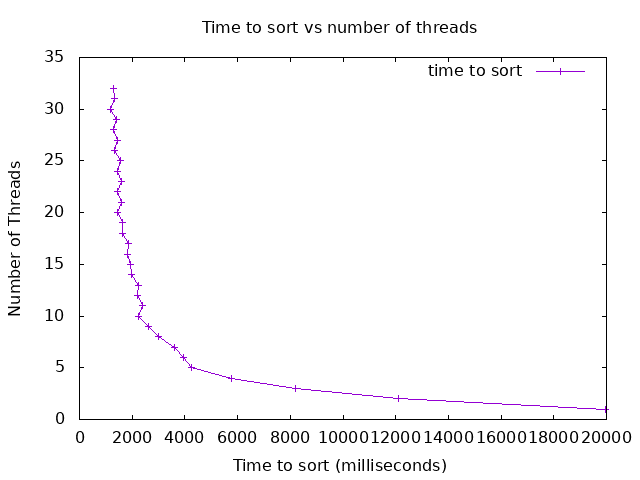

## Analysis

I do believe I was able to achieve a result similar to the example given, my graph has almost the same shape with the key difference being that mine doesn't slow down with more threads added but it instead shows slight improvements as threads continue to go up. I believe I was able to achieve a result like this due to utilizing threads even for merging, by letting the threads handle the merging for me instead of trying to do it myself I was able to see noticeable improvements over previous iterations, at least in moderately sized tests. Additionally due to my computer not having a sanitizer enabled gcc while Codespaces would randomly crash out from the sanitizer I had to perform my tests using Onyx. With Onyx's specs being what they are it's likely that with even more threads than we were permitted there would still be slight but continuous improvements. 
After ten threads there was a slowdown, and then roughly every odd thread after that had a slight slowdown. This is likely because of my choice to instead of handling all the merging in the primary thread to instead delegate it to various threads and letting them handle it. However with how I am joining the sorted partitions to give to the threads to merge there's one extra merge if the number of threads is odd, which would mean that while slight every odd threadcount would perform slightly worse as there's one more step in order to complete the merge. Thinking about this though does surprise me a little as for why it only showed up now, since every thread added up until the eleventh thread showed improvements over the previous thread.
As stated earlier there is a generally improved performance the whole time more threads are added. This is likely due to improved efficiencies when you're able to leverage merging increasingly partitioned arrays across various threads. Each thread you're able to run concurrently should show logarithmic improvements to the time. I wouldn't be surprised if Onyx would be able to run far more threads which would lead to even more improved results, even though it will likely reach a limit soon and be unable to really improve any further. 
It's hard to tell how many threads is optimal, but my choice for how many threads is optimal will be ten since the eleventh thread is the first that slows down. If it's not ten though then my choice would be twenty due to the graph afterwards being more of a back and forth with only minor improvements between even or odd threads. I do not believe that anything past twenty though is optimal as while there are slight improvements that's all they are, slight, and it looks like the graph is starting to approach a limit on how quickly it can sort the given array.
The slowest number of threads for me was one thread, which surprises me since with how I've set up my code a single thread should just be a normal merge sort. Which in hindsight this does make sense as by adding additional threads the workload on each thread goes down and concurrency allows for the array to get sorted even faster. The biggest slowdown though looks to be at eleven threads, this would be due to the extra merge required to merge in the odd numbered partition to the rest of the array.